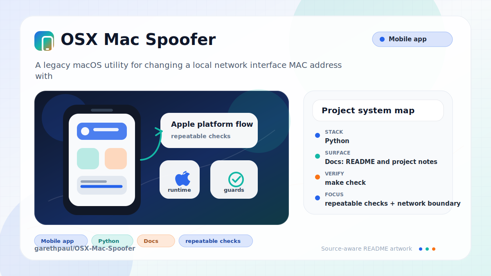

# OSX-Mac-Spoofer

<!-- README-OVERVIEW-IMAGE -->


## Overview

`garethpaul/OSX-Mac-Spoofer` is a legacy macOS utility for changing a local
network interface MAC address with `networksetup`, `airport`, and `ifconfig`.
Use it only on machines and networks where you have permission to administer
the interface.

This README is based on the checked-in source, manifests, scripts, and repository metadata on the `master` branch. The project language mix found during review was: Python (1).

## Repository Contents

- `.gitignore` - local cache, log, and environment ignores
- `CHANGES.md` - baseline change log
- `Makefile` - local verification entry point
- `README.md` - project overview and local usage notes
- `SECURITY.md` - security reporting and disclosure guidance
- `SpoofMACAddress` - legacy `/etc/rc.common` service wrapper
- `SpoofMACAddress.py` - MAC address update utility
- `StartupParameters.plist` - legacy service metadata
- `VISION.md` - project direction and maintenance guardrails
- `docs/plans/2026-06-08-mac-spoofer-baseline.md` - completed modernization plan
- `test_spoof_mac_address.py` - parser, validation, and dry-run tests

Additional scan context:

- Source directories: no top-level source directories detected
- Dependency and build manifests: `Makefile`
- Entry points or build surfaces: `SpoofMACAddress.py`, `SpoofMACAddress`
- Test-looking files: `test_spoof_mac_address.py`

## Getting Started

### Prerequisites

- Git
- Python 3
- macOS with `networksetup`, `ifconfig`, and the `airport` utility for real
  network changes

### Setup

```bash
git clone https://github.com/garethpaul/OSX-Mac-Spoofer.git
cd OSX-Mac-Spoofer
```

The setup commands above are derived from repository files. Legacy mobile, Python, or JavaScript samples may require older SDKs or package versions than a modern workstation uses by default.

## Running or Using the Project

Preview the commands without changing network state:

```bash
python3 SpoofMACAddress.py --dry-run
python3 SpoofMACAddress.py en0 aa:bb:cc:dd:ee:ff --dry-run
```

Apply a change on macOS only when you are intentionally administering the local
interface:

```bash
sudo python3 SpoofMACAddress.py en0 aa:bb:cc:dd:ee:ff
```

The script accepts MAC addresses as either 12 hex characters or
colon-separated octets. Interface names and MAC addresses are validated before
any command is executed, and MAC addresses must be nonzero unicast addresses
that are locally administered.
Interface names must not start with a dash, so option-like values such as
`--help` are rejected before they reach macOS networking tools.
Observed current and hardware addresses from `ifconfig` and `networksetup` are
normalized separately because real hardware addresses are commonly globally
administered.

The legacy `SpoofMACAddress` startup wrapper runs dry-run mode by default.
Set `SPOOF_MAC_ADDRESS_APPLY=1` only when startup-time address changes are
explicitly intended.

## Testing and Verification

- `make check`
- `python3 -m unittest discover -v`
- `python3 SpoofMACAddress.py --dry-run`

When the required SDK or runtime is unavailable, use static checks and source review first, then verify on a machine that has the matching platform toolchain.

## Configuration and Secrets

- No required secret or credential file was identified in the repository scan. If you add integrations later, keep secrets out of git.
- Do not commit network captures, interface inventories, local machine names,
  or organization-specific MAC addresses.

## Security and Privacy Notes

- Review changes touching shell execution, subprocess, or dynamic evaluation; examples from the scan include SpoofMACAddress.py.
- Changing network identifiers can affect access controls, network logs, and
  policy enforcement. Keep this tool explicit, local, and operator-controlled.
- The validator rejects multicast and all-zero MAC address values before command
  construction. Spoofed values must also be locally administered addresses.
- Observed command output is normalized without requiring the local-admin bit,
  so hardware address reporting does not block a legitimate local change.

## Maintenance Notes

- See `SECURITY.md` for vulnerability reporting and safe research guidance.
- See `CHANGES.md` and `docs/plans/2026-06-08-mac-spoofer-baseline.md` for
  the current modernization baseline.
- See `VISION.md` for project direction and contribution guardrails.

## Contributing

Keep changes small and tied to the project that is already present in this repository. For code changes, document the toolchain used, avoid committing generated dependency directories or local configuration, and update this README when setup or verification steps change.
